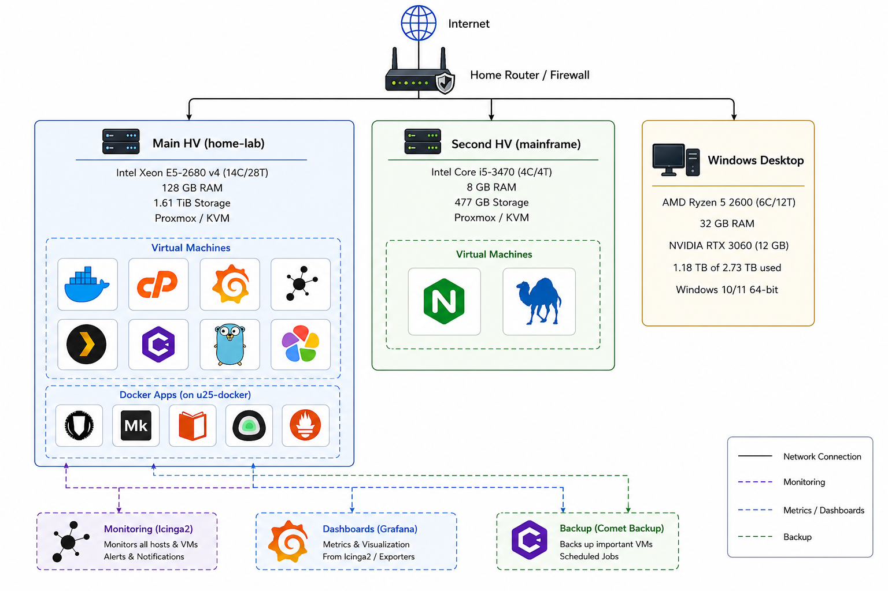

# 👋 Hi there, I'm Vladimir Ivanov

### 🌟 About Me

I'm passionate about **DevOps**, **Python** and **Go** programming, and **Cloud Infrastructure**. My focus is on scripting automation, infrastructure as code (IaC), and developing scalable, automated solutions using modern tools and frameworks.

## 🚀 Skills & Tools

### Scripting

<table>
  <tr>
    <td align="center">
      
    </td>
    <td align="center">
      
    </td>
    <td align="center">
      
    </td>
    <td align="center">
      
    </td>
  </tr>
</table>

### DevOps Tools

<table>
  <tr>
    <td align="center">
      
    </td>
    <td align="center">
      
    </td>
    <td align="center">
      
    </td>
    <td align="center">
      
    </td>
  </tr>
</table>

### Virtualization & Containerization

<table>
  <tr>
    <td align="center">
      
    </td>
    <td align="center">
      
    </td>
    <td align="center">
      
    </td>
    <td align="center">
      
    </td>
    <td align="center">
      
    </td>
  </tr>
</table>

### Monitoring

<table>
  <tr>
    <td align="center">
      
    </td>
    <td align="center">
      
    </td>
    <td align="center">
      
    </td>
  </tr>
</table>

## 📖 Learning & Evolving

I believe in **continuous learning** and stay up to date with the latest trends in DevOps, cloud computing, and infrastructure management. I'm constantly exploring new tools, mastering automation frameworks, and diving deeper into **Python** and **Go**.

## 🏠 Home Lab Infra

## 📬 Contact

- **GitHub**: [github.com/vl-tech](https://github.com/vl-tech)
